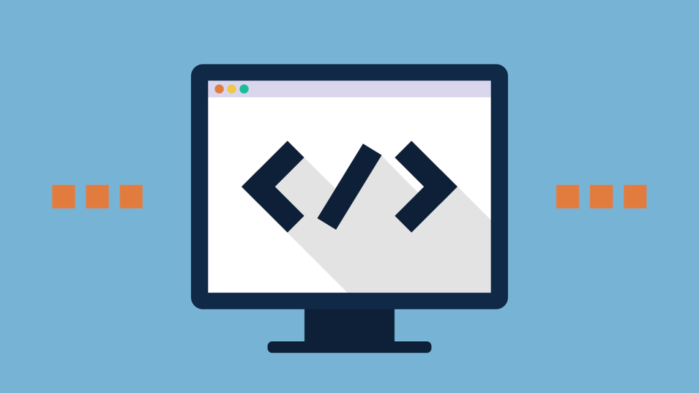
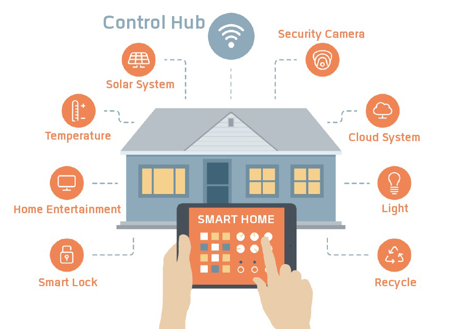
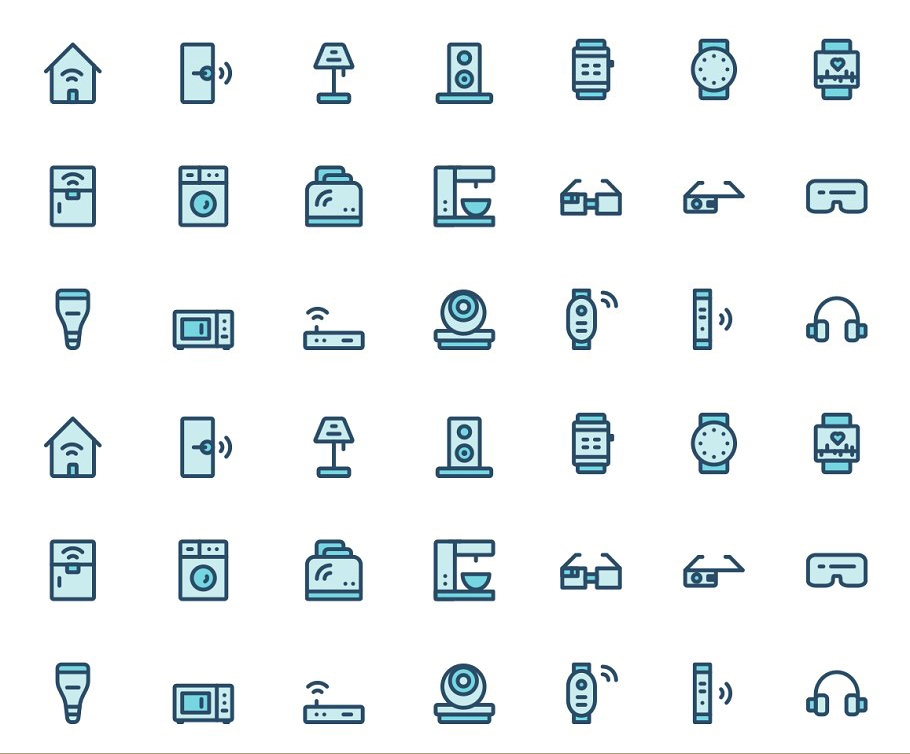

<!-- Main -->

<section id="two" class="spotlights">
	<section>
		
		

			

				<header class="major">
					<h3>NDN-Lite Library Documentation</h3>
				</header>
				
This documentation includes the modules, data structures, and other information that are useful when you are developing applications over NDN-Lite.

				<ul class="actions">
					<li><a href="https://zjkmxy.github.io/ndn-lite-docs/index.html" class="button">Learn more</a></li>
				</ul>
			

		

	</section>
	<section>
		
		

			

				<header class="major">
					<h3>Application Support Protocols of NDN-Lite</h3>
				</header>
				
There are a bunch of application support protocols that have been designed and implemented inside NDN-Lite. With these protocols, developers can simply finish security bootstrapping, access control, service discovery, trust management with simple function calls.

				<ul class="actions">
					<li><a href="https://github.com/named-data-iot/ndn-lite/wiki/Security-Bootstrapping" class="button small">Security Boostrapping</a></li>
          <li><a href="https://github.com/named-data-iot/ndn-lite/wiki/Service-Discovery" class="button small">Service Discovery</a></li>
          <li><a href="https://github.com/named-data-iot/ndn-lite/wiki/Access-Control" class="button small">Access Control</a></li>
				</ul>
			

		

	</section>
	<section>
		
		

			

				<header class="major">
					<h3>Adaptation to New Software/Hardware Platform</h3>
				</header>
				
NDN-Lite framework allows developers to adapt NDN-Lite to new software/hardware platforms.

				<ul class="actions">
					<li><a href="https://github.com/named-data-iot/ndn-lite/wiki/Overview#creating-an-adaptation-layer-with-a-face-for-a-new-platform" class="button">Learn more</a></li>
				</ul>
			

		

	</section>
</section>

